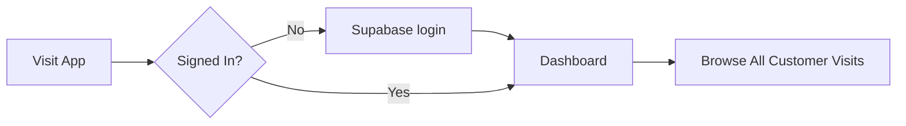

### Tech stack

- language: React
- package manager: pnpm
- build tool: Vite
- language: TypeScript

- css: TailwindCSS
- ui: Shadcn

- database: Supabase
- authentication: Supabase
- form validation: zod

### User Journey

🎯 I want to create a react app to register customer visits for a car service.

What components should I create?

### Page/Layout Components

App — Main component that handles routing and overall layout
Dashboard — Home page showing overview or navigation options
RegistrationForm — Page for registering new visits

### Feature Components

VisitForm — Form to capture visit details (date, time, service type, customer info, vehicle info)
VisitList — Display registered visits in a table or card layout
VisitDetail — Show full details of a specific visit
CustomerForm — Register or select a customer
VehicleForm — Register or select a vehicle

### UI/Utility Components

Header — Navigation bar with branding
Sidebar — Navigation menu (if needed)
Button — Reusable button component
Modal — For confirmations or dialogs
LoadingSpinner — Show loading states
Alert/Toast — Display success/error messages
FormInput — Reusable input field with validation

### Data Management Components
CustomerSelector — Dropdown/search to pick existing customers
VehicleSelector — Dropdown/search to pick existing vehicles
ServiceTypeSelector — Dropdown for service types

### Header

Create a header with:
- Logo - a place to store your tires
- Brand - compe up with an interesting name for a place to store your tires
- Avatar with user name and email

### Security

- supabase authentication

### Customer form

create a CustomerForm component where I can register a customer with the fields:
- first name
- last name
- company
- phone
- email

## Visits page

🤖 to register a new customer visit, create a visis stepper with 4 steps:
- customer info
- service info
- tires info
- summary
I will provide the details for each step later.

- ✅ search visit by license plate
- ✅ visit list
  - date
  - services performed

## Visit detail form

### 1 customer info
  - ✅ search customer by license plate
  - first name
  - last name
  - company
  - phone
  - email

### 2 service info

🤖 add as the step 2 from the stepper a ServiceForm component with the fields:
- license plate (required)
- ✅ mechanic (dropdown) (required)
- services performed (required)
- notes

### 3 tires

🤖 add as the step 3 from the stepper I want to add a tire set.
I can have a set of 4 tires on the car and 4 in storage. I want to be able to move a tire set from storage to car and from car to storage.
The storage point is defined by the section, row, shelf and floor as R1E1E2. For now this can be a string.
The number of caps is a numeric input.
- storage point: R1E1E2 (required)
- caps number: 16 (required)

To add tires, create a TireForm component with the required fields:
- width: 215
- height: 65
- diameter type: R15
- brand (autocomplete dropdown)
- rim type (radio): plate / alloy
- tire type (radio): regular / runflat
- wear indicator (radio): Good, OK, Warning, Danger
- season (radio): summer, winter, all-season

- storage point: R1E1E2
- caps number: 16
- ✅ create/edit tire
  - width: 215
  - height: 65
  - diameter type: R15
  - brand (autocomplete dropdown)
  - rim type (radio): plate / alloy
  - tire type (radio): regular / runflat
  - wear indicator (radio): Good, OK, Warning, Danger
  - season (radio): summer, winter, all-season

- ✅ edit tire
- ✅ clone tire
- ✅ delete tire

- ✅ switch: on car vs in storage

## Storage page

- section area
- row
- shelf
- floor

- tire set
  - tire
    - size: 215 / 65 R17
    - brand: Continental
    - season: summer
    - wear indicator: OK
    - condition: good
  
- edit tire
- delete tire
- clone tire

- ✅ search tire set by license plate
- ✅ move tire set to another location
